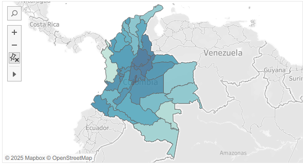
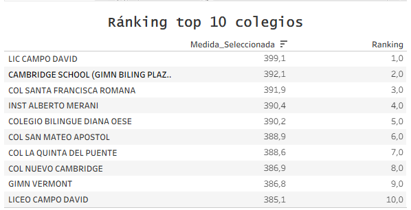

# Análisis Exploratorio de los Resultados Saber 11 en Colombia (2014–2024)

Este proyecto analiza el comportamiento de los resultados del examen Saber 11 en Colombia entre los años 2014 y 2024, aplicando técnicas de análisis de datos y visualización interactiva. El objetivo principal es identificar tendencias en los puntajes, evaluar el desempeño por áreas, realizar comparaciones regionales y destacar los colegios con mejores promedios a lo largo del tiempo.

Más de 7.5 millones de filas y más de 120 columnas fueron procesadas, limpiadas y transformadas usando Python para construir un conjunto de datos confiable y accesible para la exploración visual.

## Objetivos del proyecto

- Analizar la evolución de los puntajes por área entre 2014 y 2024.
- Comparar el rendimiento académico entre departamentos y municipios.
- Identificar los 10 colegios con mejores promedios por año.
- Visualizar estadísticas clave como promedio, máximo, mínimo y desviación estándar en cada área evaluada.

## Herramientas utilizadas

- Python y Pandas (procesamiento y análisis de datos)
- Google Colab (entorno de desarrollo)
- Tableau Public (visualización interactiva)
- GitHub (documentación del proyecto)

## Dashboard interactivo

Este tablero permite explorar visualmente los datos desde múltiples perspectivas:

- Mapa geográfico del desempeño por municipio  
- Gráficos de tendencia por área y año  
- Top 10 colegios por promedio anual  
- Filtros por ubicación, año y área evaluada

🔗 **[Ver Dashboard Saber 11 (2014–2024)](https://public.tableau.com/views/ICFES_17516865397720/DashboardICFES?:language=es-ES&:sid=&:display_count=n&:origin=viz_share_link)**

### Vista general del tablero

### Mapa interactivo por municipio

### Gráficos por área y año

### Top 10 colegios por año

## Acceso a los archivos del proyecto

Todos los insumos utilizados en este proyecto están disponibles en la siguiente carpeta de Google Drive:

- Dataset original (ICFES Saber 11)
- Archivos procesados y filtrados
- Notebook de análisis exploratorio en Google Colab

 **[Acceder a la carpeta del proyecto](https://tu-enlace-aqui.com)**

## Conclusiones destacadas

- Aunque se esperaba una caída en los puntajes promedio durante los años 2020 y 2021 por efectos de la pandemia por COVID-19, los datos no muestran una disminución drástica ni en el puntaje global ni en la mayoría de áreas.

- A partir de 2020 se registraron por primera vez puntajes perfectos en el examen, lo que plantea interrogantes sobre posibles ajustes en el modelo de evaluación o cambios estructurales en la forma de calificación.

- El tablero desarrollado permite a docentes, investigadores y tomadores de decisiones explorar fácilmente estos fenómenos por año, área y ubicación geográfica.

## ¿Por qué es útil este proyecto?

Este análisis puede apoyar iniciativas de mejora educativa, facilitar el monitoreo del rendimiento por región y servir como insumo base para estudios más profundos sobre la evolución del examen Saber 11 en la última década.

---

¿Te pareció interesante? No dudes en explorar el tablero, dejar tus comentarios o proponer nuevas ideas para análisis futuros.
