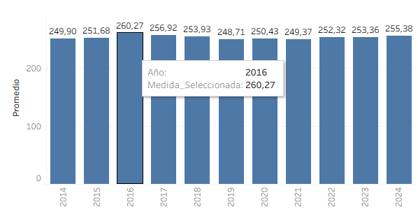

# Análisis Exploratorio de los Resultados Saber 11 en Colombia (2014–2024)

Este proyecto analiza los resultados del examen Saber 11 en Colombia durante el periodo 2014–2024. El objetivo principal es identificar tendencias, variaciones por áreas evaluadas, comparaciones entre departamentos y destacar los colegios con mejores promedios por año.

---

## Objetivos

- Explorar el comportamiento de los puntajes por área y año.
- Comparar el rendimiento entre departamentos y municipios.
- Identificar los 10 mejores colegios por año.
- Evaluar el impacto de políticas educativas y eventos como la pandemia.
- Probar visualmente medidas estadísticas como promedio, máximo, mínimo y desviación estándar.

---

## Herramientas utilizadas

- **Tableau Public** (visualización interactiva)
- **Python + Pandas** (procesamiento de datos)
- **Google Colab** (análisis inicial)
- **GitHub** (documentación del proyecto)

---

## Dashboard interactivo

Puedes ver el tablero en Tableau Public haciendo clic aquí:  
[Ver Dashboard Saber 11 (2014–2024)](https://public.tableau.com/app/profile/tu_usuario/viz/nombre-del-tablero)

---

## Acceso a los archivos del proyecto

Todos los archivos usados en este proyecto, incluyendo:

- Datasets originales (Saber 11 - ICFES)
- Archivos filtrados y procesados
- Notebook de análisis exploratorio en Google Colab

Se encuentran disponibles en la siguiente carpeta de Google Drive:

[Acceder a la carpeta del proyecto](https://drive.google.com/drive/folders/1WF1kck7dWCApWErbAg5QRV_RqUqDkzG8?usp=drive_link)

---

## Capturas del Dashboard

| Mapa Interactivo | Gráficos por Área | Top 10 Colegios |
|------------------|-------------------|------------------|
|  |  |  |

---
## Conclusiones destacadas

- Se esperaba una caída general en los puntajes promedio durante los años 2020 y 2021, debido a los retos pedagógicos y sociales asociados a la pandemia por COVID-19. Sin embargo, los datos no muestran una disminución drástica en el puntaje global ni en la mayoría de áreas.

- De forma inesperada, **por primera vez en la historia del ICFES Saber 11**, se registraron **puntajes perfectos**, lo cual genera interrogantes sobre posibles anomalías o ajustes en el modelo de evaluación a partir del año 2020.

- El tablero permite explorar visualmente estos fenómenos por área, ubicación y año, brindando herramientas para análisis más profundos por parte de instituciones educativas o investigadores.

---
